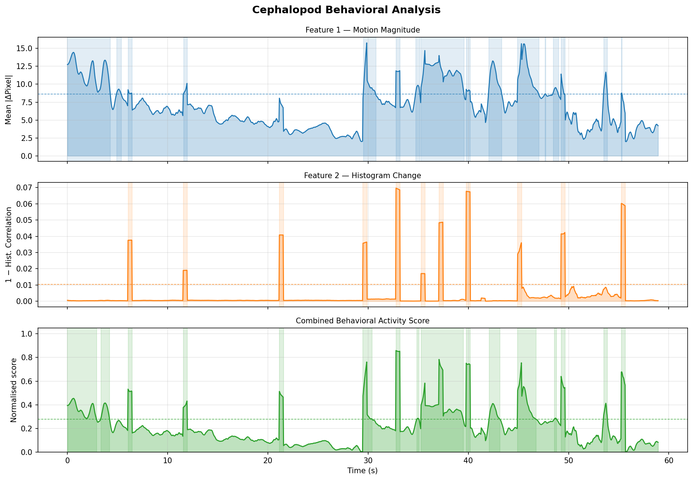
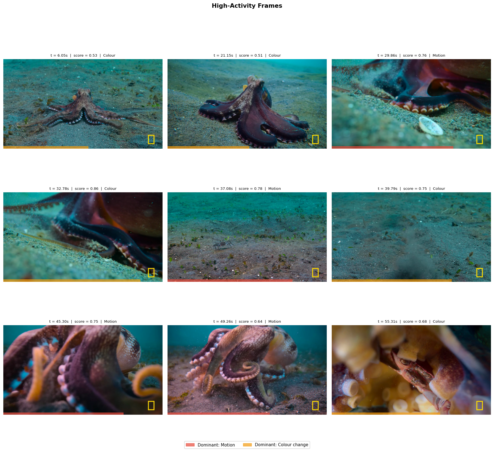
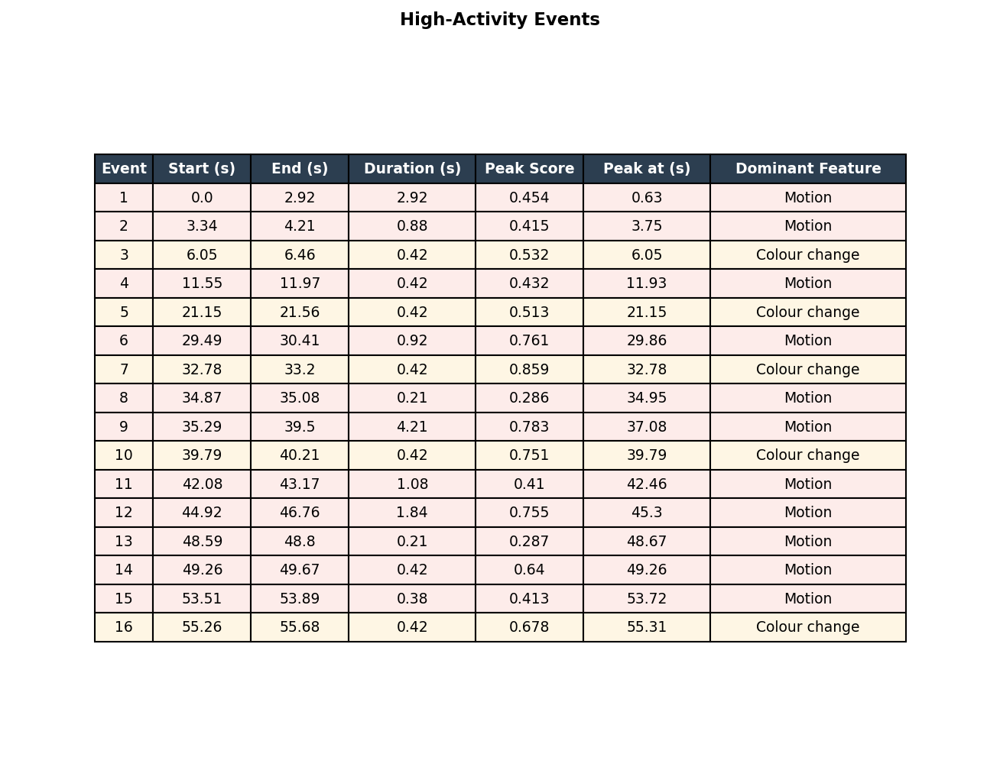
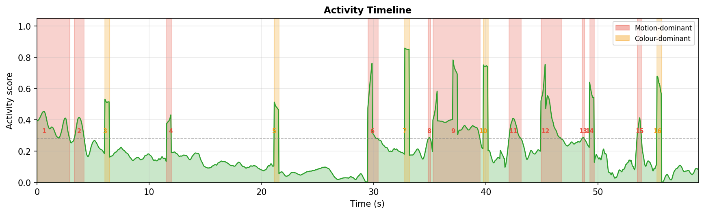

# Cephalopod Behavioral Sentiment Analysis
### GSoC 2026 Entry Task

Extracts and visualises interpretable behavioral features from a cephalopod video clip to infer animal activity and sentiment state. For the full write-up, see [`report.tex`](report.tex).

---

## Overview

This project analyzes a 59-second video of an octopus (3:34–4:33, 1280×720 px, 23.98 fps) to detect behavioral patterns — identifying periods of high activity, locomotion, and skin-pattern changes driven by chromatophores. Two simple features are extracted frame-by-frame and combined into a normalized activity score.

---

## Features Implemented

| # | Feature | Method | What it captures |
|---|---------|--------|-----------------|
| 1 | **Motion magnitude** | Mean absolute pixel difference between consecutive grayscale frames | Locomotor activity — crawling, swimming, escape jetting |
| 2 | **Histogram change** | 1 − Bhattacharyya correlation between consecutive BGR histograms | Skin-pattern dynamics driven by chromatophores and iridophores |

Both signals are smoothed with a ~0.4s uniform window and combined into a normalised **activity score** that highlights high-activity periods.

---

## Sample Output

### Behavioral Analysis Plot


Three panels showing motion magnitude, histogram change, and combined activity score over time. Shaded spans mark periods exceeding the activity threshold.

### High-Activity Frames


Top 9 activity spikes with the actual video frame at each moment. Red bar = motion-dominant, orange = colour-dominant.

### Activity Event Table


Every contiguous high-activity period with start/end time, duration, peak score, and dominant feature.

### Activity Timeline


Combined activity score with numbered event labels overlaid.

---

## Project Structure

```
.
├── analyze.py                        # Main script — extracts features, saves .npz, generates plot
├── cephalopod_analysis.ipynb         # Primary notebook — full pipeline (GSoC submission)
├── activity_visualization.ipynb      # Secondary notebook — activity events and frame viewer
├── report.tex                        # Full written report with analysis and all plots
├── requirements.txt
├── data/
│   ├── data_octopus.mp4              # 720p video clip (see Setup below)
│   └── data_octopus_features.npz     # Pre-extracted features (generated by analyze.py)
└── plots/
    └── data_octopus/
        ├── behavioral_analysis.png
        ├── activity_frames.png
        ├── activity_event_table.png
        ├── activity_timeline.png
        └── frame_preview.png
```

---

## Setup

### 1. Create and activate a virtual environment

```bash
python3 -m venv env
source env/bin/activate
```

### 2. Install dependencies

```bash
pip install -r requirements.txt
```

### 3. Get the video clip

The clip used is 3:34–4:33 of [this YouTube video](https://www.youtube.com/watch?v=ah8U0-fV6k8), downscaled to 720p.

```bash
# Download the clip
pip install yt-dlp
mkdir -p data
yt-dlp "https://www.youtube.com/watch?v=ah8U0-fV6k8" \
    --download-sections "*214-273" \
    --force-keyframes-at-cuts \
    -o "data/cephalopod_clip2.%(ext)s"

# Downscale to 720p
ffmpeg -i data/cephalopod_clip2.webm -vf scale=-2:720 -c:v libx264 -crf 22 -c:a copy data/data_octopus.mp4
```

Any 30–60 second video of an aquatic animal will work as a substitute — just update `VIDEO_PATH` in the scripts.

---

## Usage

### Step 1 — Extract features

Run `analyze.py` once to extract features and save them to a `.npz` file. This is the slow step (loads all frames).

```bash
python analyze.py                         # uses data/data_octopus.mp4 by default
python analyze.py path/to/your_video.mp4  # or pass a custom path
```

This will:
- Report video metadata (resolution, fps, duration)
- Extract motion magnitude and histogram change
- Save features to `data/data_octopus_features.npz`
- Save the behavioral analysis plot to `plots/data_octopus/behavioral_analysis.png`

### Step 2 — Explore in notebooks

Both notebooks load from the pre-computed `.npz` so they start instantly.

```bash
jupyter notebook cephalopod_analysis.ipynb     # main submission notebook
jupyter notebook activity_visualization.ipynb  # activity events and frame viewer
```

#### `cephalopod_analysis.ipynb`
The primary GSoC submission notebook. Contains:
- Video frame preview
- Feature extraction code with explanations
- 3-panel behavioral analysis plot

#### `activity_visualization.ipynb`
Deeper dive into the results. Contains:
- Top 9 high-activity frames with timestamps and scores
- Activity event table (all events with start/end times, duration, dominant feature)
- Timeline with numbered event labels

### Step 3 — Read the report

`report.tex` contains the full written analysis — feature descriptions with equations, behavioral interpretation, limitations, and all output plots. Compile with:

```bash
pdflatex report.tex
```

---

## Dependencies

| Package | Purpose |
|---------|---------|
| `opencv-python` | Video loading, frame processing, histogram computation |
| `numpy` | Array operations |
| `matplotlib` | Plotting |
| `scipy` | Signal smoothing (`uniform_filter1d`), peak detection (`find_peaks`) |
| `pandas` | Activity event table |
| `jupyter` | Running notebooks |
| `ipykernel` | Registering the virtual environment as a Jupyter kernel |
